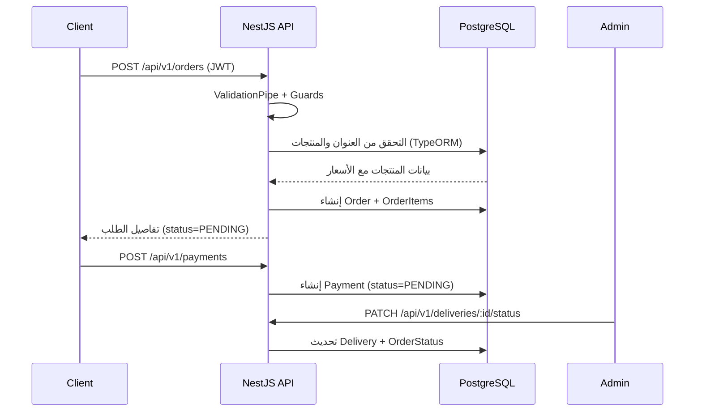

# وثيقة مشروع Coffee Shop Backend

> **آخر تحديث:** 28 ديسمبر 2025  
> **الإصدار:** 0.0.1 (مطابق لـ `package.json`)

## 1. لمحة عامة
- تطبيق خلفي مبني بـ NestJS لإدارة متجر قهوة عبر الإنترنت، يشمل المنتجات، الطلبات، التوصيل، الدفع، المراجعات، والعناوين.
- يعتمد على TypeORM مع قاعدة بيانات PostgreSQL، وتخزين الوسائط عبر Cloudinary، وتوثيق مبني على JWT.
- يوفر مسارات REST منظمة (`/api/v1/...`) مع DTOs للتحقق من المدخلات وطبقات خدمات تحتوي على منطق الأعمال.

## 2. التكديس التقني
- **Node.js + NestJS**: إطار العمل الرئيسي ([src/main.ts](../src/main.ts)).
- **TypeScript** مع إعدادات `tsconfig.json` و `tsconfig.build.json`.
- **TypeORM + PostgreSQL**: إعداد اتصال ديناميكي عبر [src/app.module.ts](../src/app.module.ts) مع تفعيل `synchronize` أثناء التطوير.
- **Cloudinary SDK** لرفع الصور ([src/cloudinary/cloudinary.service.ts](../src/cloudinary/cloudinary.service.ts)).
- **JWT + bcryptjs** للتوثيق وإدارة الصلاحيات ([src/user/provider/auth.provider.ts](../src/user/provider/auth.provider.ts)).
- **class-validator / class-transformer** لتطبيع وإسقاط المدخلات غير المتوقعة عبر `ValidationPipe` العام.

## 3. تشغيل البيئة المحلية
1. تثبيت الاعتمادات:
   ```bash
   npm install
   ```
2. إعداد ملف `.env` (انظر القسم التالي) في جذر المشروع.
3. تشغيل الخادم:
   ```bash
   npm run start:dev
   ```
4. أوامر إضافية:
   - إنتاج: `npm run start:prod`
   - بناء: `npm run build`
   - اختبارات وحدات: `npm run test`
   - اختبارات e2e: `npm run test:e2e`

## 4. المتغيرات البيئية الأساسية
| المتغير | الوصف | مثال |
|---------|--------|-------|
| `PORT` | منفذ HTTP (افتراضي 4000) | `4000` |
| `DB_HOST`, `DB_PORT`, `DB_DATABASE`, `DB_USERNAME`, `DB_PASSWORD` | إعداد اتصال PostgreSQL | `localhost`, `5432`, `coffee_db`, `postgres`, `secret` |
| `JWT_SECRET` | السر المستخدم لتوقيع رموز JWT | `super-secret` |
| `CLOUDINARY_NAME`, `API_KEY`, `API_SECRET` | إعداد حساب Cloudinary ([src/cloudinary/cloudinary.provider.ts](../src/cloudinary/cloudinary.provider.ts)) | — |
| `NODE_ENV` | `development` | `development` |

> ⚠️ في [src/app.module.ts](../src/app.module.ts#L21-L42) تم تمرير `synchronize: process.env.NODE_ENV !== 'production' || true`، ما يعني أن TypeORM يقوم بتحديث المخطط دائماً. يجب إلغاء `|| true` قبل النشر إلى الإنتاج لتجنب حذف/تعديل الجداول تلقائياً.

## 5. هيكل المشروع
```
src/
  addresses/        # CRUD للعناوين وربطها بالمستخدمين
  categories/       # إدارة الفئات وصور الغلاف
  cloudinary/       # تهيئة ورفع ملفات Cloudinary
  deliveries/       # تتبع الشحن والتعيينات
  orders/           # إنشاء الطلب والItems وحساب الإجمالي
  payments/         # إدارة الدفعات وطرق الدفع
  products/         # إدارة المنتجات وربط الفئات والمراجعات
  reviews/          # تقييمات المستخدمين للمنتجات
  user/             # التوثيق والصلاحيات والمستخدمين
  utils/            # ثوابت، أنواع، Enums مشتركة
```

## 6. طبقات التطبيق
- **Controllers**: تستقبل طلبات HTTP وتربطها بالخدمات (مثال: [src/orders/orders.controller.ts](../src/orders/orders.controller.ts)).
- **Services**: تحتوي منطق الأعمال وتتعامل مع TypeORM Repositories (مثال: [src/products/products.service.ts](../src/products/products.service.ts)).
- **Entities**: تعريف مخطط الجداول مع العلاقات (مثال: [src/orders/entities/order.entity.ts](../src/orders/entities/order.entity.ts)).
- **DTOs**: تعريف العقد الخاصة بالمدخلات والاستعلامات مع `class-validator` (مثال: [src/orders/dto/create-order.dto.ts](../src/orders/dto/create-order.dto.ts)).
- **Guards & Decorators**: حماية المسارات وتعريف الصلاحيات ([src/user/guard/auth.guard.ts](../src/user/guard/auth.guard.ts), [src/user/guard/auth-roles.guard.ts](../src/user/guard/auth-roles.guard.ts), [src/user/decorator/current-user.decorator.ts](../src/user/decorator/current-user.decorator.ts)).

### مخطط تسلسلي مبسّط لدورة الطلب


## 7. وصف الوحدات الرئيسية
### 7.1 Users & Auth
- **المسؤوليات**: التسجيل، تسجيل الدخول، إدارة ملف المستخدم، حذف الحسابات، جلب قائمة المستخدمين.
- **المكونات**: [UserService](../src/user/user.service.ts)، [AuthService](../src/user/provider/auth.provider.ts)، [UserController](../src/user/user.controller.ts)، الحراس `AuthGuard` و`AuthRolesGuard`.
- **JWT Payload**: معرف المستخدم، الاسم، والدور (`UserType` = `admin` أو `client`).
- **نقاط النهاية**:
  | Method | Path | الحماية | الوصف |
  |--------|------|---------|-------|
  | POST | `/api/user/auth/register` | علنية | إنشاء حساب جديد (إرجاع access token).
  | POST | `/api/user/auth/login` | علنية | تسجيل الدخول بـ Email/Password.
  | GET | `/api/user` | `AuthRolesGuard` + `Roles(admin)` | قائمة المستخدمين والإحصائيات.
  | GET | `/api/user/me` | `AuthGuard` | ملف المستخدم الحالي.
  | PUT | `/api/user/update-user/me` | `AuthRolesGuard` | تحديث الاسم الشخصي.
  | PUT/DELETE | `/api/user/update-user/:id`, `/delete-user/:id` | أدوار مختلفة | إدارة المستخدمين الأخرى.
- **ملاحظات**: يتم فك التشفير للباسورد باستخدام bcrypt. الحارس الدورى يستخدم `Reflector` للقراءة من Decorator `@Roles`.

### 7.2 Products Module
- **المسؤوليات**: CRUD للمنتجات، رفع صورة إلى Cloudinary، البحث، التصفية، حساب متوسط التقييم.
- **الملفات المهمة**: [products.controller.ts](../src/products/products.controller.ts), [products.service.ts](../src/products/products.service.ts), [product.entity.ts](../src/products/entities/product.entity.ts), [product-query.dto.ts](../src/products/dto/product-query.dto.ts).
- **المزايا**:
  - رفع صورة تلقائياً إذا وصل ملف `product-image`.
  - بحث نصي باستخدام `ILIKE` على الاسم/الوصف واسم الفئة.
  - تصفية حسب السعر/الفئة مع ترقيم الصفحات (`page`, `limit`).
  - إرجاع خصائص محسوبة: `avgRating`, `ratingCount`.
- **نقاط النهاية** (حالية بدون حراس، يوصى بتقييدها للأدمن):
  | Method | Path | الوصف |
  |--------|------|-------|
  | POST | `/api/v1/products` | إنشاء منتج جديد.
  | GET | `/api/v1/products` | قائمة مع ترقيم وتصفية.
  | GET | `/api/v1/products/:id` | تفاصيل المنتج + المراجعات.
  | PATCH | `/api/v1/products/:id` | تحديث البيانات/الصورة.
  | DELETE | `/api/v1/products/:id` | حذف المنتج.

### 7.3 Categories Module
- **الوظيفة**: إدارة الفئات، صورها، حالة التفعيل، وعد المنتجات المرتبطة.
- **ميزات بارزة**: منع التكرار بالاسم، رفع صورة اختيارية، منع حذف فئة تحتوي منتجات، توفير Endpoint لعدد المنتجات.
- **Endpoints**: مشابهة لـ Products لكن تحت `/api/v1/categories` (انظر [categories.controller.ts](../src/categories/categories.controller.ts)).

### 7.4 Reviews Module
- **التحقق**: يمنع إضافة تقييم مكرر لنفس المنتج من نفس المستخدم.
- **Queries**: `productId`, `userId`, `rating`, `page`, `limit`. يمكن حساب `avgRating` عند فلترة منتج محدد.
- **الحماية**: إنشاء/تحديث/حذف يتطلب JWT، مع أدوار مختلفة للحذف.

### 7.5 Addresses Module
- **الوصف**: إدارة عناوين المستخدم، تعيين عنوان افتراضي واحد، ترتيب النتائج بحيث يظهر الافتراضي أولاً.
- **الحماية**: جميع المسارات خلف `AuthGuard` باستخدام `@CurrentUser`.

### 7.6 Orders Module
- **السيرفر**: إنشاء الطلب يتحقق من ملكية العنوان، توافر المنتجات، ويخزن Snapshot للسعر.
- **الاستعلام**: يمكن للأدمن التصفية حسب `status`, `userId`, التواريخ، والمدى السعري.
- **الصلاحيات**: كل المسارات محمية؛ تغيير الحالة أو الإلغاء المتقدم يتطلب دور `admin`.
- **إحصائيات**: `/api/v1/orders/stats` ترجع إجمالي الطلبات والإيرادات وتوزيع الحالات.

### 7.7 Payments Module
- **المنطق**: يسمح بدفعة واحدة لكل طلب، يضبط `amount` تلقائياً من قيمة الطلب ويبدأ بـ `PaymentStatus.PENDING`.
- **الصلاحيات**: إنشاء/عرض الدفع يتطلب JWT، بينما تحديث الحالة أو التأكيد مخصص للأدمن.

### 7.8 Deliveries Module
- **الوظيفة**: إنشاء سجل توصيل مرتبط بالطلب، تعيين سائق، تتبع الحالة، تسجيل الوقت الفعلي عند `DELIVERED`.
- **الحماية**: جميع عمليات الإنشاء/التعديل مقيدة للأدمن، بينما المستخدم يرى فقط سجلات تخص طلباته.

### 7.9 Cloudinary Module
- يغلف الرفع باستخدام `cloudinary.uploader.upload_stream` ويحول Buffer عبر `streamifier`.
- يقبل رفع ملف واحد أو أكثر (`uploadFiles`).

### 7.10 Utils
- `enum.ts`: أدوار المستخدمين.
- `order-enums.ts`: حالات الطلب والدفع وطرق الدفع (موثقة بالعربية داخل الملف).
- `delivery-enums.ts`: حالات التوصيل.
- `constants.ts`: تعريف موحد لـ `CURRENT_TIMESTAMP(6)` لضبط الدقة.

## 8. نماذج البيانات والعلاقات
| الكيان | أبرز الحقول | العلاقات |
|-------|-------------|-----------|
| `User` | `id`, `firstName`, `lastName`, `email`, `role` | `addresses`, `orders`, `reviews`.
| `Product` | `name`, `description`, `price`, `image`, `isAvailable` | `category` (ManyToOne), `reviews`.
| `Category` | `name`, `description`, `isActive`, `image` | `products`.
| `Review` | `rating`, `comment`, `userId`, `productId` | ينتمي إلى `User` و`Product`.
| `Address` | `address`, `city`, `country`, `isDefault`, `userId` | ينتمي إلى مستخدم واحد، ويُستخدم في الطلبات.
| `Order` | `totalAmount`, `status`, `notes`, `userId`, `addressId` | يحتوي `items`, مرتبط بـ `Payment` و`Delivery` بعلاقة واحد لواحد.
| `OrderItem` | `quantity`, `price`, `size`, `customization` | ينتمي إلى Order وProduct.
| `Payment` | `amount`, `method`, `status`, `transactionId` | علاقة واحد-لواحد مع Order.
| `Delivery` | `status`, `driverName`, `estimatedDeliveryTime` | واحد-لواحد مع Order.

## 9. التحقق، الحماية، والمعترضات
- **ValidationPipe عالمي**: `whitelist`, `forbidNonWhitelisted`, و `transform` مفعّلة ([src/main.ts](../src/main.ts)).
- **ClassSerializerInterceptor** مستخدم في أغلب الـ Controllers لإخفاء الحقول المعلمة بـ `@Exclude` (كحقل كلمة المرور في [user.entity.ts](../src/user/entities/user.entity.ts)).
- **Guards**:
  - `AuthGuard`: يتحقق من JWT (Header `Authorization: Bearer <token>`).
  - `AuthRolesGuard`: يقرأ Decorator `@Roles` للتحكم بالأدوار.
- **Decorators**: `@CurrentUser()` يسحب الحمولة JWT إلى معالج الطلب.
- **رفع الملفات**: `FileInterceptor` مع أسماء حقول مختلفة (`product-image`, `category-image`).

## 10. مسار تطوير مقترح / ملاحظات هامة
1. **تأمين مسارات المنتجات والفئات**: حالياً مكشوفة، يفضّل حماية عمليات الإنشاء/التعديل بالأدوار.
2. **إدارة الأخطاء المعيارية**: التفكير في `HttpExceptionFilter` مخصص لتنسيق الاستجابات.
3. **توثيق API**: دمج Swagger (`@nestjs/swagger`) لتوليد توثيق تفاعلي.
4. **اختبارات إضافية**: توسيع محتوى `test/app.e2e-spec.ts` لتغطية مسارات الدومين المختلفة.
5. **الفصل بين بيئات التشغيل**: ضبط `ConfigModule` لاختيار ملف `.env.<env>` تلقائياً.

## 11. خطوات النشر المختصرة
1. بناء المشروع: `npm run build`.
2. تعيين `NODE_ENV=production` وتعطيل `synchronize`.
3. ترحيل قواعد البيانات يدوياً (يفضّل الاعتماد على مهاجرات TypeORM بدلاً من المزامنة).
4. ضبط متغيرات Cloudinary و JWT على مزوّد الاستضافة.
5. مراقبة المقاييس الأساسية (عدد الطلبات، الإيرادات، حالات التوصيل) عبر مسارات `/api/v1/orders/stats` أو لوحة خارجية.

---
هذه الوثيقة موجهة للمطورين الجدد في الفريق لتسريع فهمهم للبنية العامة، الوحدات، ونقاط الاندماج. يمكن تحديثها كلما تغيرت نقطة دخول أو إضافة وحدة جديدة.